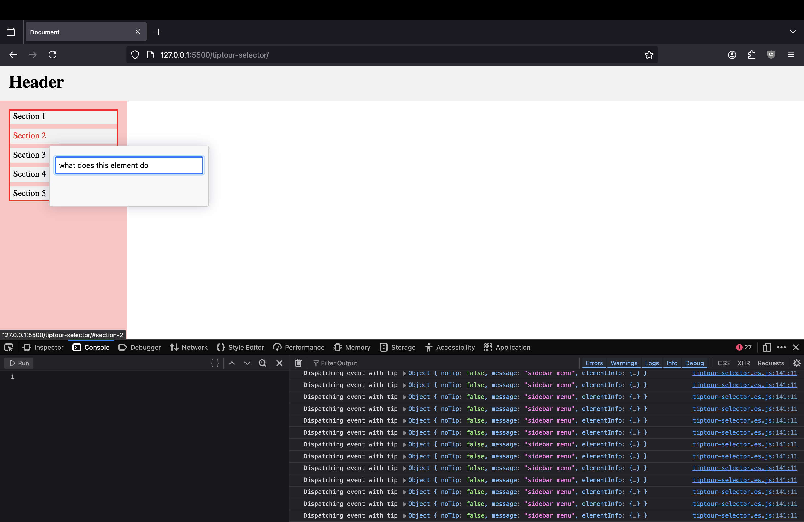

# Tiptour Selector



Tiptour Selector is a lightweight, customizable tool for creating interactive tooltips and guided tours for your web applications.

## Features

- 🚀 Easy to integrate with just a snippet

## Getting Started

### Prerequisites

Ensure you have the latest version of [Node.js](https://nodejs.org/) installed.

### Installation

1. Clone the repository:

   ```sh
   git clone https://github.com/ABSanthosh/tiptour-selector.git
   ```

2. Navigate to the project directory:

   ```sh
   cd tiptour-selector
   ```

3. Install the dependencies:

   ```sh
   npm install
   ```

4. Install `Live Server` extension for VS Code. Follow the instructions [here](https://marketplace.visualstudio.com/items?itemName=ritwickdey.LiveServer).

### Development

1. Open the `index.html` file in Visual Studio Code.

2. Start the development server:

   Run this command in the VS Code command palette (Ctrl+Shift+P):

   ```
   >Live Server: Open with Live Server
   ```

3. Start the TypeScript compilation in watch mode:

   ```sh
   npm run watch
   ```

## Contributing

Contributions are what make the open-source community such an amazing place to learn, inspire, and create. Any contributions you make are **greatly appreciated**.

1. Fork the Project
2. Create your Feature Branch (`git checkout -b feature/AmazingFeature`)
3. Commit your Changes (`git commit -m 'Add some AmazingFeature'`)
4. Push to the Branch (`git push origin feature/AmazingFeature`)
5. Open a Pull Request

## Contact

milind-soni - milindsoni201@gmail.com

---

⭐️ If you find this project useful, please consider giving it a star on GitHub!
